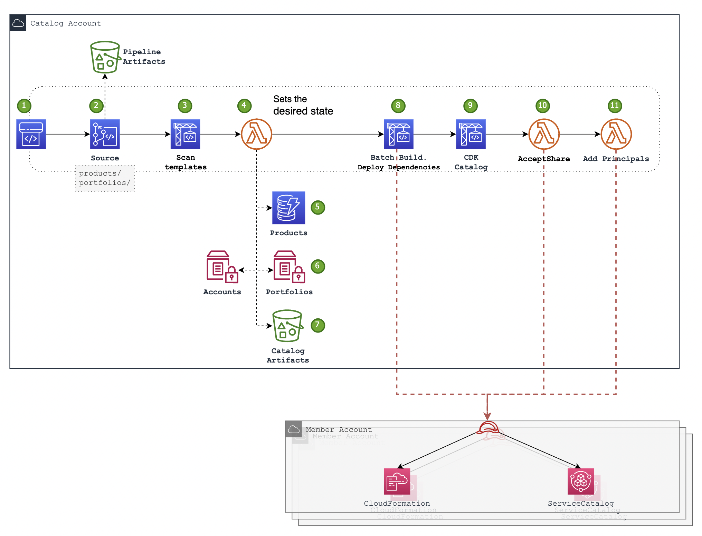

## Overview
This repository contains a CDK application which describes a codepipeline pipeline which sourced on a catalog repository, and provisions the different resources of a catalog, resulting in a provisioned [AWS Service Catalog](https://docs.aws.amazon.com/servicecatalog/latest/adminguide/introduction.html) portfolios and products across a multi-accounts AWS environment. 

In addition, this CDK application leverages [CDK Pipelines](https://docs.aws.amazon.com/cdk/v2/guide/cdk_pipeline.html) to deploy the application itself.

The service-catalog-platform supports products based on CloudFormation or SAM templates. As it is leveraging the [cloudformation package cli](https://docs.aws.amazon.com/cli/latest/reference/cloudformation/package.html) to upload local artifacts to S3, the templates for both products and dependencies can [reference local artifacts](https://docs.aws.amazon.com/AWSCloudFormation/latest/UserGuide/using-cfn-cli-package.html).

An AWS Service Catalog product may required exist infrastructure as a prerequisite.
This solution assumes 2 different prerequisites:
1. "Local" - an infrastructure resource which is local to the product target account (account that the product is aimed to be launched in).
The local prerequisites are deployed in each account that the product is shared with.
Examples: service catalog product IAM launch role; lambda function to back CFN custom resource; CFN transform; SSM Parameter with required value; etc.
1. "Remote" - an infrastructure resource which is provisioned in an account other than the product target account.
The remote prerequisites are "singletone" accross all the involved accounts.
Examples: A DynamDB table for a custom resource to record activity.

The "local" prerequisites are defined as part of the "catalog" (see [example catalog](https://github.com/ccoe-io/idp-sc-catalog/tree/main)) while the "remote" ones have to be provosioned outside of the catalog. 

## Deployment
### Deployments Account
The _deployments_ account is where the cdk application pipeline will run.
The _deployments_ account have to be bootstrapped as follows:
```bash
cdk bootstrap
```
### Hub Account
This is the account where the cdk application will be deployed to and where the catalog will eventually be provisioned and shared with the spoke accounts. Typically this will be shared services account.
The _hub_ account have to be bootstrapped as follows:
```bash
cdk bootstrap --trust <deployments-account-id> aws://<hub-account-id>/<hub-region> --cloudformation-execution-policies arn:aws:iam::aws:policy/AdministratorAccess
```
The _hub_ account have to be delegated administrator for service catalog:
```bash
aws organizations register-delegated-administrator \
    --account-id <hub-account-id> \
    --service-principal servicecatalog.amazonaws.com
```

### Spoke Accounts
The _spoke_ accounts are all the AWS accounts that will have portfolio/s shared with them.
1. Deploy a cross account role in each member account. This role will be assumed from the hub account by the pipeline to deploy product dependencies and accept portfolios share. Use the template under `xacc-role-template` to provision the role.
1. Make sure to deploy the same role to the Hub Account as well.
1. The CFN template of the recomended role can be found at `docs/xacc-role-template/`

### Update CDK parameters
Update the solution input values in [cdk.json](cdk.json) file.
```json
    "SOURCE": { <The details of the solution repository - either S3 or git repo>
      "s3": {
        "bucket_name": "",
        "bucket_key": ""
      },
      "git": {
        "repo": "<full repository path>",
        "branch": "<branch>",
        "connection_arn_ssm_parameter": "<the name of an ssm parameter that holds the codestar connection arn>"
      }
    },
    "CATALOG_SOURCE": { <The details of the catalog definition repository - either S3 or git repo>
      "s3": {
        "bucket_name": "",
        "bucket_key": ""
      },
      "git": {
        "repo": "<full repository path>",
        "branch": "<branch>",
        "connection_arn_ssm_parameter": "<the name of an ssm parameter that holds the codestar connection arn>"
      }
    },
    "SPOKE_XACC_ROLE": "<The name of the cross account role which deployed to spoke accounts>",
    "SSM_PARAM_NAME_ORG_ID": "<the name of an ssm parameter that holds the organization id>",
    "DEPLOYMENT_TARGET": {
        "account_id": "",
        "region": ""
    }
```
### Run the first deployment
1. clone the source of the platform (this) repository.
1. change directory to the cloned repository.
1. run `cdk` cli:
```bash
pip3 install -r requirements.txt
cdk bootstrap
cdk deploy
```

## Architecture



1. The codepipeline pipeline starting point. The pipeline is invoked by the source code catalog-repository push events.
2. In the catalog-repository, service catalog products and service catalog portfolios are described in a declarative manner using yaml files.
3. After Source the next step is a codebuild project which scans the cloudformation templates.
4. In this step a lambda function processes the manifests and:
5. determines the desired state for products and their versions and stores it in a dynamodb table.
6. determines The desired state for portfolios and stores in an SSM Parameter store.
7. uploads templates or other artifacts to the dedicated catalog s3 bucket. A product definition will point to the objects in this bucket, and when deploying dependencies the artifacts (cfn, source) will be expected to reside in this bucket. 
8. In addition, the lambda #4, renders the buildspec yml for the dependencies step, in which a codebuild batch jobs deploys required roles (launch roles), custom resources, and macros to the target member/spoke accounts.
9. Run the cdk application of the catalog. This creates 2 stacks, the products stack and the portfolios stack.
10. After the products and portfolios were created on #9, and the portfolios were shared with the spoke accounts, at #10 a lambda function will assume xacc role in the spokes and will accept the share from the hub account.
11. Finally, access need to be determined for each portfolio in each spoke account, which is done again by a lambda that assumes role in the spoke accounts.

## The Catalog Repository
The source for this pipeline is a repository that includes all the Portfolios and Products description (manifests).
The structure of the sources repository must have `products` folder and `portfolios` folder on its root level.
```bash
.
├── portfolios
│   └── <portfolio-folder>
│   │   │── manifest.yml
│   └── <portfolio-folder>
│       └── manifest.yml
└── products
    ├── <product-folder>
    │   ├── diagram.png
    │   ├── email-template.json
    │   ├── manifest.yml
    │   ├── permissions.json
    │   ├── README.md
    │   └── template.yml
    └── <product-folder>
        ├── diagram.png
        ├── email-template.json
        ├── manifest.yml
        ├── permissions.json
        ├── README.md
        └── template.yml
── dependencies
    ├── <dependency-folder>
    │   ├── diagram.png
    │   ├── manifest.yml
    │   ├── README.md
    │   └── template.yml
    └── <dependency-folder>
        ├── diagram.png
        ├── manifest.yml
        ├── README.md
        └── template.yml
```
